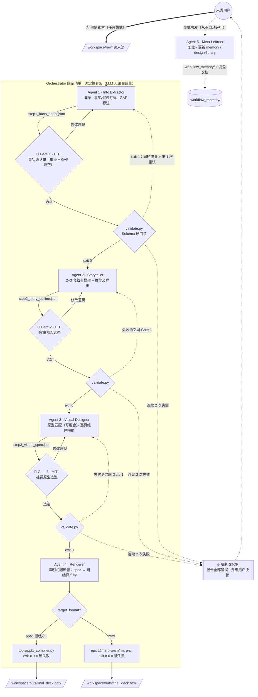

# Idea-to-Deck Pipeline

把杂乱想法变成可交付演示文稿（PPTX / HTML）的**确定性多 Agent 流水线**：
LLM 只在叶子节点做认知工作，流程由固定清单驱动，人在三个高杠杆点做选择题。

- 现状：v0.2 基线（首次端到端真实交付验证通过）+ v0.3 改进已落地（retro P1–P5 全部关闭，见 git log 与 `.workflow_memory/`）
- 深层规格见 `ARCHITECTURE.md`（现状层唯一权威）；历史评审在 `_archive/`（**仅本地，不入 git**，见 AGENTS.md）；经验沉淀在 `.workflow_memory/`

---

## 1. 项目文件架构

```text
idea2deck-workflow/
├── ARCHITECTURE.md        # 现行架构唯一权威（living）：原则评分卡、拓扑、契约、工具链
├── agents/                # 6 个角色的 PROMPT——角色行为的单一事实源
│   ├── orchestrator/      #   固定清单驱动器：调度步骤、分发门禁、执行熔断
│   ├── 01_info_extractor/ #   信息提取（附 sub_tagger.md 事实核查）
│   ├── 02_storyteller/    #   叙事架构（附 sub_frameworks.md 行业框架库）
│   ├── 03_visual_designer/#   视觉设计（附 sub_templates.md 组件库）
│   ├── 04_renderer/       #   声明式渲染翻译者
│   └── 05_meta_learner/   #   按需复盘与经验沉淀
├── schemas/               # 4 份 JSON Schema 数据契约（step1~3 + session_state）
├── tools/                 # 确定性工具：pptx_compiler.py（编译）+ validate.py（门禁）
├── design-library/        # 风格原型库（5 个 YAML，含融合原型）+ 组件定义
├── workspace/             # 单会话运行时总目录（用户输入 → 成品交付）
│   ├── raw/                 #   素材输入池——任意格式随意倾倒
│   └── outs/                #   全部中间产物与最终交付；文件即状态，无额外数据库
├── .workflow_memory/      # 经验层：best_practices.md / failure_cases.md
├── _archive/              # 冻结历史评审+运行快照：仅本地、不入 git、运行时不读（AGENTS.md 规则 1）
├── index.py               # CLI：status（派生进度）/ clean（新会话）/ reset（时间旅行）
└── clean.sh               # index.py clean 的薄封装
```

---

## 2. 整体运行机制

### 2.1 核心设计一句话

**确定性骨架，概率性叶子**：步骤顺序、门禁、熔断全部写死在 Orchestrator 清单里，
LLM 判断只发生在各 Agent 内部；节点之间不传对话历史，只传经过 Schema 校验的
JSON 工件（文件即状态，随时断点续跑）。

### 2.2 AI Agent Graph



### 2.3 节点职责一览

| 节点 | 职责（处理） | 输入（只读这些） | 输出 | 条件路由 / 门禁 | 人类介入 |
|---|---|---|---|---|---|
| **Orchestrator** | 按固定清单推进，从不自行决定下一步；每步 Gate 记一行 run_log | `index.py status`（进度从产物存在性派生） | `00_run_log.md` 追加 | 唯一"路由"是清单顺序 + 门禁结果，无 LLM 裁量 | 转达门禁问题；熔断时求助 |
| **Agent 1 Info Extractor** | 扫描 workspace/raw/、去噪、事实/假设打标、缺口标为 [GAP] 行 | `workspace/raw/` | `step1_facts_sheet.json` | 缺关键数据 → 联网补料（宿主原生检索） | **Gate 1**：单页确认表 + GAP 填空，至多 1 个追问 |
| **Agent 2 Storyteller** | 生成 2–3 套叙事框架（SCQA / 金字塔 / 问题-方案…），推荐其一；逐页规划标题、核心句、证据 ID | `step1_facts_sheet.json` | `step2_story_outline.json` | 选定后展开逐页规划 | **Gate 2**：菜单式选框架 |
| **Agent 3 Visual Designer** | 按"受众"匹配风格原型；需求横跨两原型时给融合选项（骨架/点缀规则）；逐页映射布局组件 | `step2_story_outline.json` + `design-library/` | `step3_visual_spec.json` | 仅推荐，不替用户决定 | **Gate 3**：菜单式选原型（可选手含融合项） |
| **Agent 4 Renderer** | 声明式翻译：把 spec 翻成 Marp markdown 或送编译器；样式只准取自 design-library，禁 ad-hoc | `step3_visual_spec.json`、`step2_story_outline.json`、`design-library/` | `final_deck.pptx` / `final_deck.html` | 按 `target_format` 分流；编译器 exit ≠ 0 = 硬失败（禁止静默空 deck） | — |
| **Agent 5 Meta-Learner** | 复盘运行质量，沉淀经验、增补设计库、产出带 DoD 的改进建议 | `workspace/outs/` + 运行证据 | `.workflow_memory/` 更新、复盘文档 | **仅用户显式触发**，交付后绝不自动运行 | 用户点名才运行 |
| **validate.py（工具）** | 全部产物对 JSON Schema 校验，一次性报出全部错误（避免多轮往返修复） | `workspace/outs/*.json` + `schemas/` | exit 0 / 1 / 2 | exit 1 → 写入 Agent 同轮修复 → 重试 #1 → 再失败即熔断 | 熔断后由用户裁决 |

### 2.4 人在哪里介入（HITL 设计）

系统拒绝"黑盒全自动"，把人类判断压到**信息熵最大的 4 个点**，且全部是选择题——
菜单和推荐由 Agent 备好，人类只做决策，不做体力活：

| 介入点 | 你做的事 | 花费 |
|---|---|---|
| ① 投料 | 把素材（txt/md/pdf/截图…）丢进 `workspace/raw/` | 一次性 |
| ② Gate 1 事实确认 | 在单页确认表上核对事实/假设、填 [GAP] 空 | ~1 分钟 |
| ③ Gate 2 叙事选型 | 从 2–3 套框架中选一个（含推荐+理由） | ~10 秒 |
| ④ Gate 3 视觉选型 | 从 2–3 个风格原型中选一个（可含融合项） | ~10 秒 |
| ⑤ 熔断（罕见） | 同一步连续 2 次校验失败时，决定下一步怎么走 | 仅故障时 |
| ⑥ 点名复盘 | 满意/不满意后说"复盘这次运行"，Meta-Learner 才启动 | 可选 |

### 2.5 失败路径（确定性熔断）

`validate.py` exit 1 → 完整错误清单交还给**写该产物的 Agent**（上下文还热）同轮修复
→ 重试 #1 → **同一 step 再失败即熔断**：STOP、run_log 记录、请用户裁决。
同一步永不重试两次以上——从制度上杜绝 Agent 自我修复死循环烧 Token。

---

## 3. 用户怎么使用

```bash
# ① 新会话（旧一轮 workspace/raw/ + workspace/outs/ 归档到 _archive/sample_<session>/，不删除任何文件；
#    run_log 原件保留；--format html 可切换目标格式）
python3 index.py clean            # 或 ./clean.sh [--format html]

# ② 倾倒素材——不需要整理，越全越好
cp ~/Desktop/notes.md ~/Downloads/spec.pdf workspace/raw/

# ③ 在任意 CLI Coding Agent（ZCode / Codex / Antigravity…）里启动流水线：
#    "请作为 Orchestrator，依据 agents/orchestrator/PROMPT.md，
#     处理 workspace/raw/ 并生成 deck"

# ④ 在三个 Gate 处做选择题（Agent 会端上 2–3 个选项 + 推荐理由）

# ⑤ 交付物在 workspace/outs/：final_deck.pptx（或 .html）+ 全部中间产物
```

运行中与运行后的常用操作：

```bash
python3 index.py status              # 查看进度（从产物存在性派生，永不失真）；
                                     # 中断后重启流水线会自动从缺件处续跑
python3 index.py reset --from step3  # 时间旅行：不满意风格？只重做 step3 及以后，
                                     # 事实表和叙事大纲保留，不重复花钱花时间
```

典型交互体验（摘自真实运行）：

```text
[Gate 1] "事实表已生成（9 事实 / 5 假设 / 1 GAP：目标受众）。
          GAP 处已给选项：A 高管汇报 B 客户提案 C 内部评审——推荐 A，理由：…"
[你]     "A"
[Gate 2] "2 套叙事：1) SCQA 2) 痛点突围。推荐 1，理由：…"
[你]     "1"
[Gate 3] "2 个原型：1) 麦肯锡权威 2) 高管120秒冲击（另可融合：麦肯锡骨架+120秒点缀）。
          推荐融合，规则：…"
[你]     "融合"
[Agent4] "渲染完成：workspace/outs/final_deck.pptx（10 页，校验全绿）"
```

依赖：`pip install jsonschema python-pptx`（HTML 路线另需 `npx` / Node）。

---

## 4. 术语表

**格式 / 文件类型**

| 缩写 | 全称 | 解释 |
|---|---|---|
| PPTX | PowerPoint Open XML | PowerPoint 的压缩打包格式（`.pptx` 交付物） |
| HTML | HyperText Markup Language | 超文本标记语言，网页格式交付物 |
| PDF | Portable Document Format | 便携文档格式，素材常见输入 |
| MD | Markdown | 纯文本轻量标记语言（`.md`，库存 prompt 与文档均用） |
| TXT | Text | 纯文本 |
| YAML | YAML Ain't Markup Language | 缩进式数据/配置格式（`design-library/` 5 个原型文件） |
| JSON | JavaScript Object Notation | 轻量数据交换格式（步骤产物 `*.json`） |

**技术 / 环境**

| 缩写 | 全称 | 解释 |
|---|---|---|
| CLI | Command Line Interface | 命令行界面（`index.py` 的入口形态） |
| LLM | Large Language Model | 大语言模型——本流水线里只在叶子节点做判断 |
| Agent | （架构术语） | 承担某一角色的行为组件，本 repo 里均指 LLM 驱动的角色 |
| npm / Node | Node.js / Node Package Manager | JS 运行时与包管理器（HTML 路线依赖） |
| npx | npm exec | 直接运行 Node 包 CLI（`@marp-team/marp-cli` 靠它跑） |
| Marp | Markdown Presentation Ecosystem | 把 Markdown 编译为演示文稿/预览的工具 |
| exit code | Exit code | 进程退出码，本 repo 语义：0 通过 / 1 校验失败 / 2 工具错误 |

**方法 / 概念**

| 缩写 | 全称 | 解释 |
|---|---|---|
| HITL | Human In The Loop | 人在回路——README 的三道 Gate 选择题介入点 |
| GAP | Gap（信息缺口） | 事实表中缺数据待填的占位行，写作 `[GAP]` |
| SCQA | Situation-Complication-Question-Answer | 情境→冲突→问题→答案，麦肯锡叙事框架选项之一 |
| DoD | Definition of Done | 完成的定义/验收标准（Meta-Learner 复盘产出的要求） |
| retro | Retrospective | 复盘（如 v0.3 retro：P1–P5 改进项） |
| Gate | 门禁 / 检查点 | 确定性校验环节，本 repo 特指三个 HITL 选择题关卡 |

**项目私有命名（易混淆，一并说明）**

| 名称 | 含义 |
|---|---|
| Gate 1 / 2 / 3 | 事实确认、叙事选型、视觉选型三个选择题关卡 |
| step1 / step2 / step3 | 步骤产物：`facts_sheet` / `story_outline` / `visual_spec` |
| run_log | 运行日志，`workspace/outs/00_run_log.md`，由 Orchestrator 逐步追加 |
| clean / reset | `index.py` 子命令：新会话清理（归档不删除） / 时间旅行（从某步重做） |
| target_format | 目标格式，分流出口：`pptx`（默认）或 `html` |
| index.py status | 从产物存在性派生进度的 CLI，文件即状态、永不失真 |

## 5. 文档导航（三层模型）

| 想知道 | 去哪 |
|---|---|
| 现在的架构是什么、为什么 | `ARCHITECTURE.md`（living，唯一权威） |
| 发生过什么评审、怎么演化的 | `_archive/`（冻结，**仅本地**，索引见 `_archive/README.md`） |
| 学到了什么经验教训 | `.workflow_memory/`（best_practices / failure_cases） |
